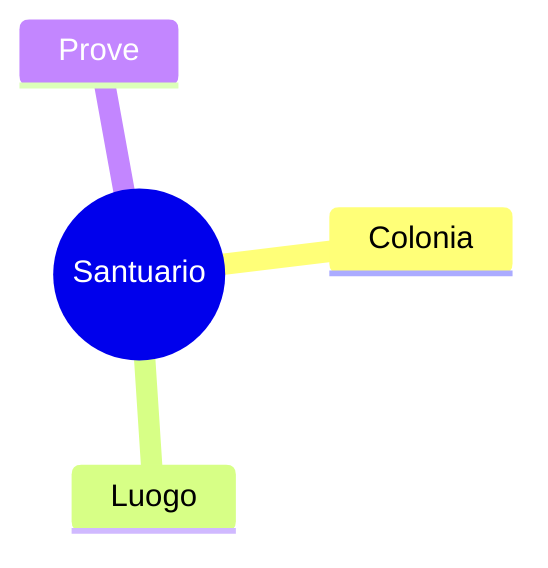
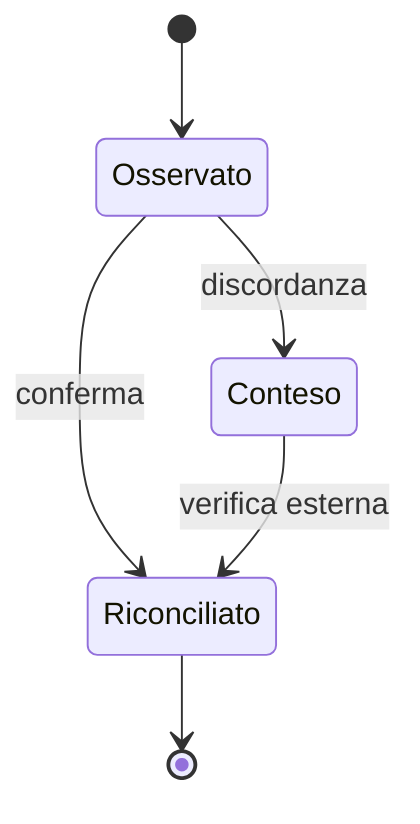
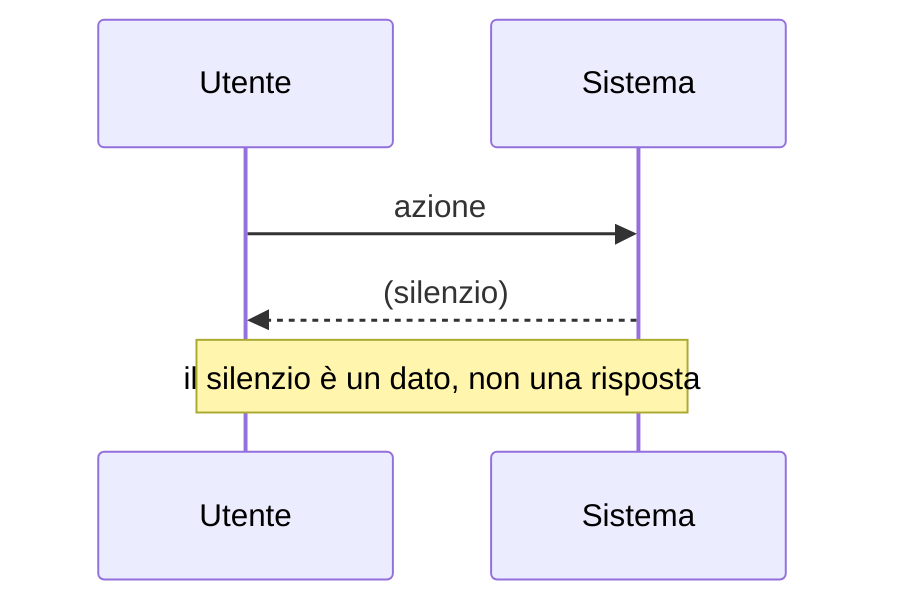

# Esempio di prova della pipeline

Questo file **non** contiene i 27 grafici originali (G01–G27): quelli stanno
nella conversazione in cui sono nati e non sono in questo repository. Serve a
provare la pipeline e a mostrare le tre regole per gli ID.

## G01 · Visione in una mappa

ID preso dal titolo markdown.

## Una tabella in mezzo (come G14 e G17)

| ID | Tipo |
|---|---|
| G02 | tabella, non Mermaid |

## Riconciliazione

ID preso dal commento nella prima riga del blocco: la tabella sopra non lo sposta.

